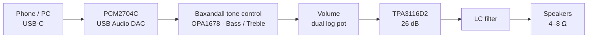

<h1 align="center">🔊 Class-D Stereo Audio Amplifier</h1>

<p align="center">
  
  
  
  
</p>

An open-source stereo **Class-D** audio amplifier with a **USB-C digital input**, analog **bass / treble tone control** and a **volume knob**, built around the Texas Instruments **TPA3116D2** and designed in **KiCad 10.0**.

Plug a phone or a PC into the USB-C port: the board shows up as a standard USB sound card (no drivers needed) and drives a pair of passive bookshelf speakers (4–8 Ω) from a single **24 V DC** supply.

---

> 🛠️ **Project Status: Active Development (v1)**
> The v1 schematic is being finalized; PCB layout comes next. Suggestions and feedback are welcome!

> 📶 **About Bluetooth**
> Bluetooth support is currently **on hold**. It will be reintegrated in a future hardware revision, once the v1 board (USB-C, without Bluetooth) has been built and validated.

---

## 📋 Table of Contents
- [Technical Specifications](#-technical-specifications)
- [Signal Chain](#-signal-chain)
- [Circuit Blocks](#-circuit-blocks)
- [Gain Structure](#-gain-structure)
- [Repository Structure](#-repository-structure)
- [Manufacturing](#-manufacturing)
- [Roadmap](#-roadmap)
- [License](#-license)

---

## ⚡ Technical Specifications

| Parameter | Value |
| :--- | :--- |
| **Supply voltage** | 24 V DC (3–5 A recommended), 5.5 × 2.1 mm barrel jack |
| **Audio input** | USB-C (USB 2.0 Full-Speed, USB Audio Class 1.0), 16-bit / up to 48 kHz |
| **DAC** | Texas Instruments **PCM2704C** |
| **Tone control** | Active Baxandall – bass and treble, about ±12 dB |
| **Amplifier IC** | Texas Instruments **TPA3116D2** (stereo BTL, Master mode, 26 dB) |
| **Output power** | ≈ 2 × 40 W into 4 Ω (clean), up to 2 × 50 W at 10 % THD |
| **Speaker load** | 4–8 Ω passive speakers |
| **Speaker outputs** | Phoenix Contact MKDS 1,5/2-5,08 screw terminals |
| **Controls** | Bass, Treble, Volume (dual-gang potentiometers) |
| **PCB** | 2 layers, FR-4, 1.6 mm, 1 oz copper |

---

## 🔗 Signal Chain



---

## 🧩 Circuit Blocks

### USB-C input and DAC
- USB 2.0 Type-C receptacle with **5.1 kΩ** pull-downs on CC1/CC2 (device / UFP), so the phone acts as host and supplies VBUS
- **USBLC6-2SC6** ESD protection on D+, D− and VBUS
- **PCM2704C** bus-powered from VBUS: USB Audio Class 1.0, driverless on Android, iOS, Windows, macOS and Linux
- 12 MHz crystal, 22 Ω series resistors and 1.5 kΩ pull-up on D+
- AC-coupled line outputs (10 µF + 47 kΩ)

### Tone control
- Active **Baxandall** network (one per channel) around a TI **OPA1678** (dual, rail-to-rail output, low noise)
- **Bass:** shelf centred around ≈ 50 Hz, tuned for deep 808-style bass
- **Treble:** ≈ 8–10 kHz, mainly to tame harsh highs
- Unity gain with the knobs centred

### Volume
- Dual-gang **A10K** logarithmic potentiometer
- Placed **after** the tone stage, so it also attenuates op-amp noise at low listening levels

### Analog supply
- **L78L12** LDO: 24 V → 12 V for the op-amp
- **VREF = 6 V** virtual ground (100 kΩ / 100 kΩ divider + 10 µF) for single-supply operation

### Power amplifier (TPA3116D2)
- **Gain / mode:** 20 kΩ to GND and 100 kΩ to GVDD on `GAIN/SLV` → Master mode, 26 dB, 30 kΩ input impedance
- **Inputs:** single-ended, negative inputs AC-grounded through capacitors matching the positive ones (3.3 µF)
- **Modulation:** BD mode, 400 kHz switching, no power limit
- **PVCC decoupling:** 1 nF + 100 nF ceramic + 220 µF + 470 µF low-ESR bulk on each side of the IC
- **Output filter:** 10 µH / 680 nF LC filter + RC snubbers for EMI
- **Protection:** `FAULTZ` tied to `SDZ` for automatic recovery after a fault
- **Thermal:** the DAD package has its **PowerPAD on top**, so a heatsink must be mounted on the IC

### Anti-pop
- The PCM2704C `SSPND` signal (high when USB audio is active) drives a **2N7002** inverter on the TPA3116D2 `MUTE` pin
- RC network on `MUTE` (100 kΩ + 4.7 µF): unmute ≈ 1 s after the DAC becomes active, mute within ≈ 0.1 s when the phone is unplugged, slew rate within datasheet limits
- RC delay on `SDZ` (100 kΩ + 10 µF) keeps the amplifier in shutdown while the supplies settle at power-up

### Front-panel controls

| Knob | Part | Function |
| :--- | :--- | :--- |
| **Bass** | B100K dual-gang (RV1) | Low-frequency boost / cut |
| **Treble** | B100K dual-gang (RV2) | High-frequency boost / cut |
| **Volume** | A10K dual-gang (RV3) | Master volume |

---

## 📊 Gain Structure

The gain chain is chosen so that **full volume reaches maximum clean power without clipping**, and the op-amp keeps headroom even with the bass knob fully up.

| Stage | Gain | Level at full scale |
| :--- | :--- | :--- |
| PCM2704C output | – | 0.64 Vrms |
| Tone control (flat) | ×1 (0 dB) | 0.64 Vrms |
| Volume (max) | ×1 | 0.64 Vrms |
| TPA3116D2 | ×20 (26 dB) | ≈ 12.8 Vrms → ≈ 40 W into 4 Ω |

Worst case (full-scale track, +12 dB bass boost): the OPA1678 output swings ≈ 7.2 Vpp around 6 V, well inside its 12 V rail-to-rail range. If the amplifier clips, it happens **after** the volume knob, so turning the volume down removes it.

---

## 📁 Repository Structure

```
Class-D-Bluetooth-5.0-Stereo-Audio-Amplifier/
├── KiCad_Project/
│   ├── Audio_Amp_v1/          # v1 – USB-C DAC + tone control (schematic + PCB)
│   └── Fabrication_files/     # Gerber, drill, BOM and CPL (coming soon)
├── libs/                           # Project-specific symbols, footprints and 3D models
└── README.md
```

### Schematic sheets

| Sheet | Content |
| :--- | :--- |
| `USB_DAC` | USB-C, ESD protection, PCM2704C, crystal, L78L12, power input, speaker terminals, anti-pop driver |
| `Tone_Volume_control` | OPA1678, VREF, Baxandall networks (L/R), volume potentiometer |
| `Power_Amplifier` | TPA3116D2, gain setting, PVCC decoupling, LC output filter, EMI snubbers |

---

## 🏭 Manufacturing

The board is designed to be manufactured by **JLCPCB** and assembled by hand (stencil + hot plate / hot air for SMD parts, soldering iron for through-hole parts).

| Option | Value |
| :--- | :--- |
| Layers | 2 |
| Thickness | 1.6 mm |
| Copper | 1 oz |
| Gerber export | Protel extensions, no X2 attributes |
| Drill | Excellon, mm, PTH + NPTH merged |
| Stencil | Top side only |

---

## 🗺️ Roadmap

**v1 – USB-C DAC (current)**
- [x] USB-C input and PCM2704C DAC
- [x] Baxandall tone control and volume
- [x] TPA3116D2 power stage
- [x] Anti-pop circuit
- [ ] ERC and schematic review
- [ ] Tone control AC simulation (ngspice)
- [ ] PCB layout and DRC
- [ ] Fabrication, assembly and bring-up
- [ ] Measurements (frequency response, THD+N, noise)
- [ ] Enclosure and front panel

**Future**
- [ ] Bluetooth input (reintegrated once v1 is validated)

---

## 📜 License

This hardware project is released under the **CERN Open Hardware Licence Permissive v2 ([CERN-OHL-P v2](https://ohwr.org/cernohl))**.

<p align="center">Designed by <b>LOREDATI Circuits</b></p>
